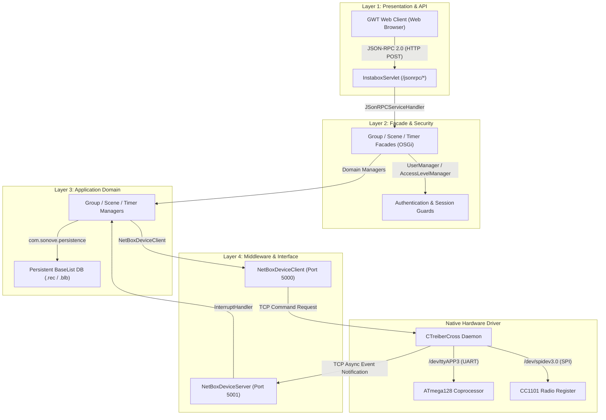

# eNet Smart Home Server: Technical Documentation Portal

Welcome to the technical documentation repository for the reverse-engineered eNet Smart Home Server (Jung / Gira) and its custom MQTT gateway integration. This portal indexes all architectural, data, process flow, and integration analyses generated during the deep code audit.

---

## 1. System-Wide Architectural Overview

The eNet gateway consists of a GWT-based web administration panel communicating via JSON-RPC 2.0 with a Java OSGi container (Apache Felix) running on Poky Yocto Linux. The OSGi container handles business logic, persistence, and JNI integrations, and communicates via a loopback TCP socket with the native C daemon `CTreiberCross`, which drives physical transceivers and antennas via serial and SPI buses.

---

## 2. Documentation Directory Index

Select any document from the list below to access deep technical findings:

| File Name | Functional Scope | Key Highlights & Diagrams |
| :--- | :--- | :--- |
| **[overview.md](file:///hostrup/data/dev/enet/docs/architecture/overview.md)** | Core Architecture & Security Audit | • OSGi start level hierarchy and boundaries • Core UML class relationships diagram • **7 categorized security audit vulnerabilities** (Blockers to Lows) with a hardening roadmap. |
| **[data_model.md](file:///hostrup/data/dev/enet/docs/architecture/data_model.md)** | Persistence & Layer 1 Traceability | • Breakdown of the custom persistence format (`.baselist`, `.rec`, `.blb`, and `.jrn` journaling) • Client-to-Server JSON-RPC transport mappings • Database **Entity-Relationship (ER) Diagram** • Routing table for all 20 JSON-RPC subpaths. |
| **[process_flows.md](file:///hostrup/data/dev/enet/docs/architecture/process_flows.md)** | Process Flows & Performance Tuning | • OSGi startup order and bundle registration flow • Request execution synchronization pipeline sequence • Transaction & domain-level lock lifecycle sequence • **Optimization audit** highlighting global mutex bottlenecks. |
| **[api_reference.md](file:///hostrup/data/dev/enet/docs/architecture/api_reference.md)** | Domain & Service Traceability | • End-to-end request routing trace (e.g. `addElement`) across 4 layers • Feature-to-interface layer mapping matrix • Cross-package interaction flowchart • Reflection, parameter annotation, and type-matching deserialization rules. |
| **[hardware_interface.md](file:///hostrup/data/dev/enet/docs/architecture/hardware_interface.md)** | Middleware & Native Driver | • Loopback TCP sockets mapping (Ports 5000/5001) • Binary framing protocol byte structures • Native UART (`/dev/ttyAPP3`) and SPI (`/dev/spidev3.0`) device bindings • **Producer-consumer shared context synchronization model** sequence • Native C driver function call routing diagram. |
