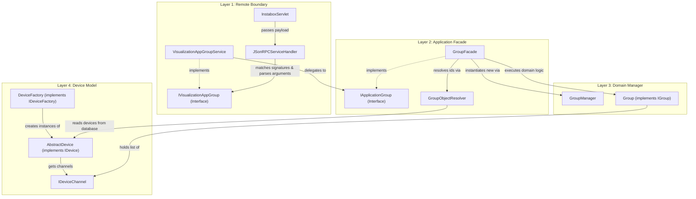

# eNet Layer 2 Architecture & Traceability Reference

This document maps out the API boundary and application-to-domain routing for the eNet Instabox server. Specifically, it documents the request tracing, interface contracts, method signatures, and class interactions across the Servlet, Application Facade, Domain Services, and Device Model layers.

---

## 1. Architectural Overview

The eNet architecture uses a highly decoupled, layered design to separate remote API access from domain business logic and hardware communication:

```
+-----------------------------------------------------------------------------------+
|                            Layer 1: Remote API Boundary                           |
|       (JSON-RPC Servlets & GWT-Compatible Remote Interfaces / DTO Definitions)    |
+-----------------------------------------------------------------------------------+
                                         │
                                         ▼
+-----------------------------------------------------------------------------------+
|                        Layer 2: Application Facade Services                       |
|         (OSGi Service Decoupling, Security Verification & Transaction Management)  |
+-----------------------------------------------------------------------------------+
                                         │
                                         ▼
+-----------------------------------------------------------------------------------+
|                       Layer 3: Application Domain Services                        |
|             (Business Managers, Persistence Containers, Task Managers)            |
+-----------------------------------------------------------------------------------+
                                         │
                                         ▼
+-----------------------------------------------------------------------------------+
|                            Layer 4: Device Domain Model                           |
|      (Device Catalogs, Channel Models, Function Blocks, Physical Communication)   |
+-----------------------------------------------------------------------------------+
```

*   **Layer 1 (Remote API Boundary):** The incoming HTTP requests are processed via a custom JSON-RPC servlet (`InstaboxServlet`). Service interfaces in `de.infoteam.insta.instaboxservlet.api.service` declare the endpoints exposed to clients.
*   **Layer 2 (Application Facade Services):** Implements the servlet service interfaces (in `de.infoteam.insta.instaboxservlet.services`), performs role-based and access-level checks via `AccessLevelManager`/`UserManager`, and delegates to application facades. Application interfaces in `com.insta.instanet.instanetbox.application` define the OSGi service interfaces.
*   **Layer 3 (Application Domain Services):** Managed by OSGi activators. Classes in `com.insta.instanet.instanetbox.applications` (e.g., `GroupManager`, `TimerManager`) process persistence-related tasks and invoke device models.
*   **Layer 4 (Device Domain Model):** Located in `com.insta.instanet.instanetbox.devicemodel.device`. Manages states (`IDevice`, `IDeviceChannel`) and physical communication (e.g. read/write to hardware).

---

## 2. End-to-End Request Routing Walkthrough

To understand the flow of control and data, we trace a typical request: adding a device channel to a user group via `VisualizationAppGroupService.addElement(groupUID, elementUID)`.

### Step 1: HTTP Post Request Reception
The client issues a POST payload containing a JSON-RPC 2.0 request:
```json
{
  "jsonrpc": "2.0",
  "method": "VisualizationAppGroupService.addElement",
  "params": {
    "groupUID": "grp_living_room",
    "elementUID": "dev_dimmer_01:2"
  },
  "id": 42
}
```
*   **Target Class:** [InstaboxServlet](file:///home/hostrup/enet_project/src2/de/infoteam/insta/instaboxservlet/servlets/InstaboxServlet.java)
*   **Method:** `doPost(HttpServletRequest request, HttpServletResponse response)`
*   **Processing:**
    1.  The raw input stream is read.
    2.  Jackson deserializes the payload into a [JSonRPCRequest](file:///home/hostrup/enet_project/src2/de/infoteam/insta/instaboxservlet/json/rpc/JSonRPCRequest.java) object.
    3.  `InstaboxServlet` invokes `serviceHandler.onCall(serviceName, jsonRpcString, jsonRpcRequest)`.

### Step 2: JSON-RPC Service Handler Dispatch
*   **Target Class:** [JSonRPCServiceHandler](file:///home/hostrup/enet_project/src2/de/infoteam/insta/instaboxservlet/json/rpc/JSonRPCServiceHandler.java)
*   **Method:** `onCall(String string, String string2, JSonRPCRequest jSonRPCRequest)`
*   **Processing:**
    1.  Looks up the service registration in `mappingStringToService` (which returns the [VisualizationAppGroupService](file:///home/hostrup/enet_project/src2/de/infoteam/insta/instaboxservlet/services/VisualizationAppGroupService.java) instance).
    2.  Calculates the hash code of the target method (`"addElement"`).
    3.  Resolves method metadata ([HashedInfoMethod](file:///home/hostrup/enet_project/src2/de/infoteam/insta/instaboxservlet/json/rpc/HashedInfoMethod.java)) from the service interface [IVisualizationAppGroup](file:///home/hostrup/enet_project/src2/de/infoteam/insta/instaboxservlet/api/service/IVisualizationAppGroup.java).
    4.  Calls `createAndCheckArgumentsList` to parse, type-match, and validate arguments.

### Step 3: Argument Deserialization and Signature Verification
*   **Target Class:** [JSonRPCServiceHandler](file:///home/hostrup/enet_project/src2/de/infoteam/insta/instaboxservlet/json/rpc/JSonRPCServiceHandler.java)
*   **Method:** `createAndCheckArgumentsList(JsonNode jsonNode, HashedInfoMethod hashedInfoMethod, int n)`
*   **Processing:**
    1.  Inspects parameter annotations on the service interface. The method `addElement` parameters are annotated with:
        *   `@ParameterName(value="groupUID")` (type `String`)
        *   `@ParameterName(value="elementUID")` (type `String`)
    2.  Verifies the JSON request parameters contains `"groupUID"` and `"elementUID"`. If missing or extra keys are found, a `JsonInvalidParametersException` is thrown.
    3.  Converts the JSON parameter nodes using `deserializeParameter` to Java `String` arguments.
    4.  Invokes `VisualizationAppGroupService.addElement("grp_living_room", "dev_dimmer_01:2")` via reflection.

### Step 4: GWT Service Implementation Execution
*   **Target Class:** [VisualizationAppGroupService](file:///home/hostrup/enet_project/src2/de/infoteam/insta/instaboxservlet/services/VisualizationAppGroupService.java)
*   **Method:** `addElement(String string, String string2)`
*   **Processing:**
    1.  Validates that the group is not write-protected / read-only:
        `ReadOnly readOnly = this.getFlagReadOnly(string);`
        `if (readOnly.isReadOnly()) { throw new MiddlewareIllegalArgumentException(string); }`
    2.  Retrieves the OSGi application group service:
        `IApplicationGroup iApplicationGroup = ServletServiceProvider.getInstance().getApplicationGroup();` (which evaluates to the `GroupFacade` singleton).
    3.  Delegates call to facade:
        `iApplicationGroup.addElement(string, string2);`

### Step 5: Application Facade Boundary and Event Dispatching
*   **Target Class:** [GroupFacade](file:///home/hostrup/enet_project/src2/com/insta/instanet/instanetbox/application/group/GroupFacade.java)
*   **Method:** `addElement(String groupUID, String elementUID)`
*   **Processing:**
    1.  Resolves target domain models via a [GroupObjectResolver](file:///home/hostrup/enet_project/src2/com/insta/instanet/instanetbox/application/group/GroupObjectResolver.java):
        *   `IGroup group = this.objectResolver.getGroup(groupUID);`
        *   `IDeviceChannel channel = this.objectResolver.getElement(elementUID);`
    2.  Invokes domain logic to add the channel:
        `group.addElement(channel);`
    3.  Sets the persistence timestamp:
        `ApplicationTimestamp.setTimestamp("groups", true);`
    4.  Triggers XML serialization to disk:
        `ApplicationFacadePersistenceHelper.persist((IItemToUpdate)group, false);`
    5.  Sends a notification event to OSGi listeners:
        `this.sendGroupChangedEvent(groupUID);` (fires `AP/GroupChanged`).

### Step 6: Domain Model Interaction (Resolution)
*   **Target Class:** [GroupObjectResolver](file:///home/hostrup/enet_project/src2/com/insta/instanet/instanetbox/application/group/GroupObjectResolver.java)
*   **Method:** `getElement(String elementUID)`
*   **Processing:**
    1.  Splits `elementUID` by `":"` into `[ "dev_dimmer_01", "2" ]`.
    2.  Retrieves the device domain model using the first part:
        `IDevice device = (IDevice)ApplicationActivator.persistManager.getObjectFromUID("dev_dimmer_01");`
    3.  Resolves the device channel using the channel number (second part):
        `IDeviceChannel channel = device.getDeviceChannel(2);`
    4.  Returns the [IDeviceChannel](file:///home/hostrup/enet_project/src2/com/insta/instanet/instanetbox/devicemodel/device/channel/IDeviceChannel.java) instance.

### Step 7: Device Domain Model Layer Execution
*   **Target Class:** [Group](file:///home/hostrup/enet_project/src2/com/insta/instanet/instanetbox/applications/group/Group.java) (implementing [IGroup](file:///home/hostrup/enet_project/src2/com/insta/instanet/instanetbox/applications/group/IGroup.java))
*   **Method:** `addElement(IDeviceChannel channel)`
*   **Processing:**
    1.  Adds the `IDeviceChannel` object to the internal elements list.
    2.  Maintains bidirectional mapping relationships.

---

## 3. Interface Layer Mapping

The table below illustrates the corresponding interfaces across layers for each major system application:

| Feature Application | GWT Service Interface (Layer 1) | Application Service Interface (Layer 2) | Application Domain Interface (Layer 3) | Device Domain Interfaces (Layer 4) |
| :--- | :--- | :--- | :--- | :--- |
| **Groups** | `IVisualizationAppGroup` | `IApplicationGroup` / `IApplicationGroupAdmin` | `IGroup` | `IDevice`, `IDeviceChannel` |
| **Timers** | `IVisualizationAppTimer` | `IApplicationTimer` / `IApplicationTimerAdmin` | `ITimer`, `IProgram` | `IDevice`, `IDeviceChannel` |
| **Conjunctions** | `IVisualizationAppConjunction` | `IApplicationConjunction` / `IApplicationConjunctionAdmin` | `IConjunctionStatusAction` | `IDevice`, `IDeviceChannel` |
| **Simulation** | `IVisualizationAppSimulation` | `IApplicationSimulation` / `IApplicationSimulationAdmin` | (Internal to Simulation Engine) | `IDevice`, `IDeviceChannel` |
| **Metering** | `IVisualizationAppMetering` | `IApplicationMetering` | `IMeteringRecord`, `IConsumption` | `IDevice`, `IDeviceChannel` |
| **Internal Values** | `IVisualizationAppInternalValue` | `IApplicationInternalValue` / `IApplicationInternalValueAdmin` | `IInternalValue` | `IDeviceValue`, `IDevice` |

---

## 4. Cross-Package Interactions Flow

The following Mermaid diagram traces the interactions across the `de.infoteam` servlet layer, the `com.insta` application services, the domain manager components, and the hardware device model packages:



---

## 5. Parameter and Type Matching Rules

The RPC reflection mechanism requires exact matching between GWT interfaces and implementation methods. Below is the mapping rule matrix:

*   **Signature Matching:** Methods in implementations (`de.infoteam.insta.instaboxservlet.services`) must match the class name, method name, argument count, and parameter names exactly as defined in the client-exposed interfaces (`de.infoteam.insta.instaboxservlet.api.service`).
*   **Argument Name Matching:** Parameter name matching is done using the `@ParameterName` annotation. For example:
    `public void addElement(@ParameterName(value="groupUID") String var1, @ParameterName(value="elementUID") String var2)`
    The corresponding JSON parameters must have exact matches (`"groupUID"` and `"elementUID"`).
*   **Argument Type Deserialization Rules:**
    *   **Primitive Types / String:** Directly mapped (e.g. `String` from `JsonNode.asText()`, `boolean` from `JsonNode.asBoolean()`).
    *   **Arrays:** Expects JSON array and converts elements recursively based on the array component type.
    *   **List / ArrayList:** Requires `genericTypeParameter` to be specified in the `@ParameterName` annotation (e.g. `genericTypeParameter=CurrentValue.class`). Elements are deserialized recursively.
    *   **Abstract DTOs:** Uses specialized helper deserializers (e.g., `CurrentValueJsonNode`, `CurrentValueWithUIDJsonNode`, `ParameterValueJsonNode`) to map to their concrete implementations.
*   **Return Values:** Service implementations wrap middleware outputs into web-compatible result DTOs (e.g., `GroupUID`, `Groups`, `CurrentValueWithUIDBoolean`, `StatusActionUID`) which Jackson converts back into standard JSON-RPC response shapes.

---

## 6. Key Verifications and Assertions

1.  **Strict Security Mapping:** The GWT layer enforces role-based access before invoking facade logic:
    *   `AccessLevelManager.get().isGroupVisibleForCurrentUser(groupUID)` is checked inside service logic.
    *   Access-level values are stored as parameters (`accessLevelAdmin`, `accessLevelRead`, `accessLevelStatus`, `accessLevelWrite`) on `IGroup` and checked via `UserManager.getInstance().isAllowedForCurrentUser(level)`.
2.  **State Synchronization & Persistence:**
    *   Modifying calls in Layer 2 (like `addElement` or `deleteGroup`) write update timestamps (`ApplicationTimestamp.setTimestamp(...)`) and invoke `ApplicationFacadePersistenceHelper.persist(...)` to write current memory state to the filesystem config.
    *   Operations trigger OSGi events (`sendGroupChangedEvent`, etc.) to inform other sub-modules and clients (via Server-Sent Events / SSE) of state modifications.
3.  **Entity Resolution Integrity:**
    *   Elements inside groups are represented as `IDeviceChannel` instances.
    *   The ID structure is strictly formatted as `deviceUID:channelNumber` (e.g. `dev_living_dimmer:1`).
    *   The split logic in `GroupObjectResolver.getElement(String elementUID)` verifies string validity before loading objects via the `persistManager`.
