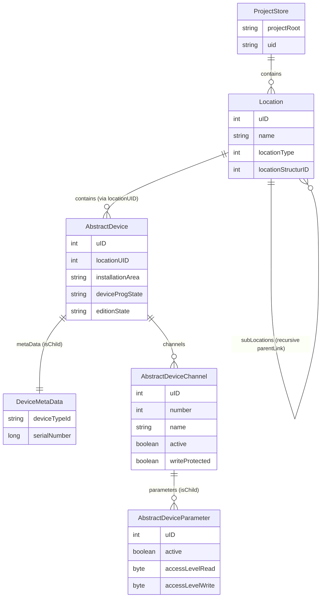

# eNet Project: Persistence Layer & API Traceability Document

This document provides a comprehensive architectural analysis of the custom persistence framework (`com.sonove.persistence`) and the Layer 1 API Traceability (GWT client-to-servlet endpoints) for the eNet project.

---

## 1. Custom Persistence Layer Mapping

The eNet system utilizes a highly specialized, custom object-oriented persistence framework (Sonove Persistence Framework) designed to store and manage state without the overhead of standard relational (SQL) or document databases.

### 1.1 Serialization File Formats
State information, configurations, and topology are stored in binary file triplets on disk (typically located under the `DataOnServer/storage/` directory):

1. **`.baselist` Files (Metadata Descriptors):**
   Small text files mapping base lists (collections of objects) to their actual data storage files. Each `.baselist` descriptor contains exactly 4 lines:
   - Line 1: Base List Unique Identifier (UID).
   - Line 2: Relative filename on disk (e.g., `<base_list_id>.rec`).
   - Line 3: Fully-qualified Java class type of the collected objects (e.g., `com.insta.instanet.instanetbox.devicemodel.device.AbstractDevice`).
   - Line 4: File ID (integer).

2. **`.rec` Files (Record Files):**
   Fixed-length binary files containing contiguous blocks of object records. Fields of basic data types (primitives, flags) are serialized into these records at specific offsets calculated by type-specific serialization helpers called **Blobbers** (e.g., `BlobberLong`, `BlobberBase`).

3. **`.blb` Files (Companion Blob Files):**
   Binary companion files storing variable-length data (strings, arrays, item links, child collections) that cannot fit into fixed `.rec` structures. The `.rec` file stores an index/offset reference (a `Long` pointer) referencing the corresponding blob records inside the companion `.blb` file.

### 1.2 Transaction Journaling & Recovery
Data integrity during writes is managed by a transactional system:
- A binary journal file is maintained at `<project_folder>/.transaction/transaction_journal.jrn`.
- It records low-level operations (file updates, record additions, allocations, and blobs) prior to executing writes.
- During startup (`ProjectImpl.bootup()`), `TransactionJournal.hasBrokenTransaction()` scans the journal. If an uncommitted transaction is detected, the database rolls back all modified records to their pre-transaction states, ensuring crash recovery.

---

## 2. Layer 1 (Web/API Client) Traceability

The frontend web interface is compiled via **GWT (Google Web Toolkit)**. The communication between the web interface and the OSGi-hosted backend servlet takes place over a custom **JSON-RPC 2.0** protocol.

### 2.1 Request Serialization (Frontend)
The GWT compiler translates client-side Java service calls into optimized JavaScript. The client establishes JSON-RPC requests by structuring the payload as follows:
- **`jsonrpc`**: Fixed version string `"2.0"`.
- **`method`**: `<service_prefix>.<method_name>` (e.g., `"management.userLogin"`).
- **`params`**: An object containing key-value pairs matching parameter names.
- **`id`**: A unique call request identifier.

*Example compiled JS transport handler:*
```javascript
function N_e(a,b,c){
    var d={};
    d.jsonrpc='2.0';
    d.method=b;
    d.params=c;
    d.id=a;
    return d;
}
```

### 2.2 Server-Side Dispatch (Servlet Layer)
1. **Endpoint Entrypoint:** The main servlet `InstaboxServlet` is registered with the OSGi `HttpService` under `/jsonrpc/*` inside `Activator.java`.
2. **Path & Method Parsing:** When an HTTP POST request hits `/jsonrpc/`, the servlet reads the payload. If the method field contains a dot (e.g., `management.userLogin`), the prefix before the dot determines the service registry key.
3. **Reflective Invocation:** The servlet passes the request to `JSonRPCServiceHandler.onCall()`.
4. **Parameter Matching:** The handler maps incoming json-keys in the `params` object to Java method arguments using parameters annotated with `@ParameterName`.
5. **Execution & Return:** The target service implementation executes, and the results are serialized back to the client as JSON-RPC responses.

---

## 3. Persistent Data Entities (ER Diagram)

The following Mermaid diagram represents the primary persistent entities inside the eNet model (`com/insta/instanet/instanetbox/`) and their relationships managed by the Sonove Persistence framework.



---

## 4. Web Endpoint to Java Servlet Flow Table

Below is the complete routing mapping for the JSON-RPC endpoints registered in the system under the main servlet context.

| Endpoint Request URL Path | Mapped Java Service Interface | Backend Implementation Class | Functional Domain Description |
| :--- | :--- | :--- | :--- |
| `/jsonrpc/management` | `de.infoteam.insta.instaboxservlet.api.service.IManagement` | `de.infoteam.insta.instaboxservlet.service.ManagementService` | Client authentication, session management, firmware/box updates, log levels, and storage statistics. |
| `/jsonrpc/management/remoteaccess` | `de.infoteam.insta.instaboxservlet.api.service.IManagementRemoteAccess` | `de.infoteam.insta.instaboxservlet.service.ManagementRemoteAccessService` | Secure remote connection settings, status queries, and activation. |
| `/jsonrpc/management/thirdpartysystem` | `de.infoteam.insta.instaboxservlet.api.service.IManagementThirdPartySystem` | `de.infoteam.insta.instaboxservlet.service.ManagementThirdPartySystemService` | Integrations with external APIs and cloud services (e.g., Tado, AWS). |
| `/jsonrpc/visualization` | `de.infoteam.insta.instaboxservlet.api.service.IVisualization` | `de.infoteam.insta.instaboxservlet.service.VisualizationService` | Serves client initialization and live visual status tracking. |
| `/jsonrpc/visualization/app_conjunction` | `de.infoteam.insta.instaboxservlet.api.service.IVisualizationAppConjunction` | `de.infoteam.insta.instaboxservlet.service.VisualizationAppConjunctionService` | Logical gate logic and interlocking state updates for UI visualization. |
| `/jsonrpc/visualization/app_group` | `de.infoteam.insta.instaboxservlet.api.service.IVisualizationAppGroup` | `de.infoteam.insta.instaboxservlet.service.VisualizationAppGroupService` | Visualization of grouped components, scenes, and collective statuses. |
| `/jsonrpc/visualization/app_metering` | `de.infoteam.insta.instaboxservlet.api.service.IVisualizationAppMetering` | `de.infoteam.insta.instaboxservlet.service.VisualizationAppMeteringService` | Retrieval of electricity, gas, and power load consumption history. |
| `/jsonrpc/visualization/app_simulation` | `de.infoteam.insta.instaboxservlet.api.service.IVisualizationAppSimulation` | `de.infoteam.insta.instaboxservlet.service.VisualizationAppSimulationService` | Presence simulation execution logs and schedule tracking. |
| `/jsonrpc/visualization/app_internalvalue` | `de.infoteam.insta.instaboxservlet.api.service.IVisualizationAppInternalValue` | `de.infoteam.insta.instaboxservlet.service.VisualizationAppInternalValueService` | Virtual indicators, variables, and user flags on visual screens. |
| `/jsonrpc/visualization/app_timer` | `de.infoteam.insta.instaboxservlet.api.service.IVisualizationAppTimer` | `de.infoteam.insta.instaboxservlet.service.VisualizationAppTimerService` | Fetches visual scheduler configurations, weekly programs, and timers. |
| `/jsonrpc/commissioning` | `de.infoteam.insta.instaboxservlet.api.service.ICommissioning` | `de.infoteam.insta.instaboxservlet.service.CommissioningService` | Device configuration, layout scanning, project database load/upload, and setup changes. |
| `/jsonrpc/commissioning/app_signalquality` | `de.infoteam.insta.instaboxservlet.api.service.ICommissioningAppDiagnosticsSignalQuality` | `de.infoteam.insta.instaboxservlet.service.CommissioningAppDiagnosticsSignalQualityService` | RF signal strength diagnostics and diagnostic link quality records. |
| `/jsonrpc/commissioning/app_telegrams` | `de.infoteam.insta.instaboxservlet.api.service.ICommissioningAppDiagnosticsTelegrams` | `de.infoteam.insta.instaboxservlet.service.CommissioningAppDiagnosticsTelegramsService` | Tracing, recording, and analyzing real-time bus telegram packets. |
| `/jsonrpc/commissioning/app_scene` | `de.infoteam.insta.instaboxservlet.api.service.ICommissioningAppScene` | `de.infoteam.insta.instaboxservlet.service.CommissioningAppSceneService` | Scene editing, binding, and command mapping during setup. |
| `/jsonrpc/visualization/app_scene` | `de.infoteam.insta.instaboxservlet.api.service.IVisualizationAppScene` | `de.infoteam.insta.instaboxservlet.service.VisualizationAppSceneService` | Interactive scene trigger options for end-user visual displays. |
| `/jsonrpc/commissioning/app_conjunction` | `de.infoteam.insta.instaboxservlet.api.service.ICommissioningAppConjunction` | `de.infoteam.insta.instaboxservlet.service.CommissioningAppConjunctionService` | Binds logical criteria (AND/OR blocks) to physical channels. |
| `/jsonrpc/commissioning/app_group` | `de.infoteam.insta.instaboxservlet.api.service.ICommissioningAppGroup` | `de.infoteam.insta.instaboxservlet.service.CommissioningAppGroupService` | Grouping controls together, binding key switches to device channels. |
| `/jsonrpc/commissioning/app_timer` | `de.infoteam.insta.instaboxservlet.api.service.ICommissioningAppTimer` | `de.infoteam.insta.instaboxservlet.service.CommissioningAppTimerService` | Configures and programs scheduled background timers for device nodes. |
| `/jsonrpc/commissioning/app_internalvalue` | `de.infoteam.insta.instaboxservlet.api.service.ICommissioningAppInternalValue` | `de.infoteam.insta.instaboxservlet.service.CommissioningAppInternalValueService` | Declares system-wide internal variables for automation scripts. |
| `/jsonrpc/commissioning/app_simulation` | `de.infoteam.insta.instaboxservlet.api.service.ICommissioningAppSimulation` | `de.infoteam.insta.instaboxservlet.service.CommissioningAppSimulationService` | Sets up simulation triggers, recording replay timelines, and variables. |
