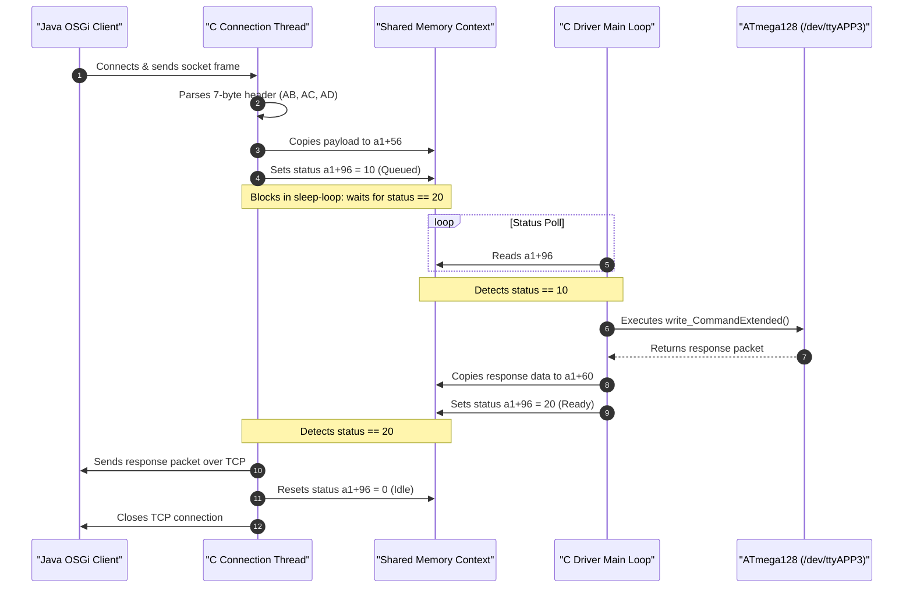

# eNet Project: Layer 3 (Middleware & Native Driver) Traceability Document

This document provides a comprehensive analysis of the Layer 3 middleware-to-hardware interface in the eNet gateway system. It details the synchronous command routing and asynchronous notification flow between the OSGi Java middleware (`com.insta.instanet.instanetbox`) and the native C driver daemon (`CTreiberCross`), outlining socket communication, message frame structures, C function mappings, and physical hardware driver bindings (`/dev/ttyAPP3`, `/dev/spidev3.0`).

---

## 1. Java Device Domain to Socket Flow

The OSGi Java container manages high-level device logic and configuration parameters. To interact with the physical transceiver module, the middleware leverages a bidirectional TCP loopback loop.

### 1.1 Process Management & Lifecycle
*   **`DriverManager`**: A singleton class managing the lifecycle of the native driver process. It starts and terminates `/home/insta/felix-framework/driver/CTreiberCross -nojavacheck` and reads its PID via the OSGi `ISystemHandler`.
*   **`DriverThread`**: A dedicated Java thread that spawns the `CTreiberCross` executable via `ProcessBuilder`.
    *   Prior to execution, it calls `wait4ClientPortClosed()` to confirm the loopback port `5000` is vacant by temporarily attempting to bind a `ServerSocket` on it.
    *   Once confirmed free, it starts the native process and redirects its standard error stream to the Java logger.
*   **`NetBoxDeviceClient`**: A utility used by `InstaNetBoxDeviceService` to perform synchronous request-response transactions with the driver. It opens a TCP socket to `127.0.0.1:5000` (`network.client.remote.port`), writes the serialized `Message`, waits for a synchronous response frame, and immediately closes the connection.
*   **`NetBoxDeviceServer`**: A persistent server socket thread running in the Java container listening on `127.0.0.1:5001` (`network.server.port`). It accepts inbound event/interrupt TCP connections initiated by `CTreiberCross`.
    *   Upon accepting a connection, it spawns a `Connection` thread which parses incoming messages via a `MessageReader` and pushes them to `InterruptHandler.getHandler().pushInterrupt(message)`.

### 1.2 Loopback Socket Mapping
```
   +-------------------------------------------------------------------+
   |                       OSGi Java Middleware                        |
   |                                                                   |
   |  [NetBoxDeviceClient]                       [NetBoxDeviceServer]  |
   +----------+-------------------------------------------^-----------+
              | (TCP Client)                              | (TCP Server)
              |                                           |
    Port 5000 | Command Requests                Port 5001 | Async Events
    (Loopback)| [Header] + [Payload]            (Loopback)| [Interrupts]
              |                                           |
   +----------v-------------------------------------------+-----------+
   |                        CTreiberCross Daemon                       |
   |                                                                   |
   |  [osgi2atmega TCP Server]                [atmega2osgi TCP Client] |
   +-------------------------------------------------------------------+
```

---

## 2. Middleware-to-Driver Communication Protocol

All messages passed between the Java middleware and the C daemon conform to a standardized 7-byte binary header followed by a variable-length command payload.

### 2.1 The 7-Byte Binary Header
The binary structure of the header is serialized as follows:

| Byte Offset | Data Type | Field | Description |
| :--- | :--- | :--- | :--- |
| **0 - 1** | `char[2]` | `id` | Frame Signature. Must begin with `'A'`. The second character designates target destination:<br>• `'C'` (ATM8: ATmega8 command)<br>• `'D'` (ATM128: ATmega128 command)<br>• `'B'` (BUNDLE: Bundle update)<br>• `'F'` (FILE: File operations)<br>• `'P'` (PRODUCTION: Production mode) |
| **2 - 5** | `int32` | `length` | Big-endian payload size (number of bytes following the header). |
| **6** | `byte` | `status` | `MessageStatus` code (e.g. `0` = OK, `1` = NOK, `255` = DUMMY). |

### 2.2 Payload Command Structures
When sending a command message (type `'C'` or `'D'`), the first byte of the payload represents the `Command` ID. Key command IDs include:

*   **`STOP (3)`**: Requests C daemon termination.
*   **`GET_VERSION (4)`**: Returns the C driver daemon version.
*   **`SERIAL_CLOSE (5)` / `SERIAL_OPEN (6)`**: Opens or closes the physical serial hardware line.
*   **`LED (32)`**: Controls the device's 5 physical LEDs. Requires a 2-byte payload:
    *   `xx` (Byte 1): A bitmask indicating which LEDs should be illuminated (ON or BLINK).
    *   `yy` (Byte 2): A bitmask indicating which of the active LEDs should flash (BLINK).
*   **`ANT (48)`**: Configures internal/external antenna states for the 2.4 GHz and 868 MHz bands using a single byte:
    *   `0x08` = Auto 2.4G, `0x04` = Auto 868, `0x02` = Ext 2.4G, `0x01` = Ext 868.
*   **`GET_KEY (64)`**: Reads physical button status changes.
*   **`FW_UPDATE_ATM128 (161)`**: Starts the firmware upgrade process for the ATmega128 co-processor.

---

## 3. Native C Driver Deep Dive (`CTreiberCross.c`)

The native driver executable is an ARM-compiled daemon responsible for bridging loopback socket commands into low-level hardware registers.

### 3.1 Hardware Bindings
1.  **`/dev/ttyAPP3` (High-Speed UART)**: The primary serial port interface used to communicate with the ATmega128 RF transceiver co-processor. It is opened via `function_11ec8` (using standard `open("/dev/ttyAPP3", O_RDWR | ...)`), storing the file descriptor at global pointer `*(int32_t *)0x2ad60`.
2.  **`/dev/spidev3.0` (SPI Interface)**: Used for high-speed direct communication with the radio chip (e.g. CC1101) or co-processor SPI registers. It is opened via `function_11000` (which applies `ioctl(fd, SPI_IOC_MESSAGE(1))` configuration commands), storing its file descriptor at `*(int32_t *)0x2ad5c`.

> [!NOTE]
> The actual KNX RF protocol stack for building automation (switching, dimming telegrams) runs in-process inside the Java Virtual Machine via the Weinzierl **`kdriveJniAdapter`** (`System.loadLibrary("kdriveJniAdapter")`), binding directly to `/dev/ttyAPP1` via native JNI methods defined in `SerialPortProxy.java`. `CTreiberCross` is specifically dedicated to peripheral device handling (LEDs, antenna switching, reset buttons, and co-processor flashing).

### 3.2 Asynchronous Synchronization Model
Because socket communication is concurrent but serial reads/writes are block-sensitive, `CTreiberCross` uses a producer-consumer thread-synchronization model utilizing a shared memory context structure `a1`:

*   **Socket Context Offsets**:
    *   `*(int32_t *)(a1 + 68)`: Socket file descriptor `fd`.
    *   `*(int32_t *)(a1 + 96)`: State variable (`0` = Idle, `10` = Command Received/Queued, `20` = Response Ready).
    *   `*(int32_t *)(a1 + 56)`: Command input buffer pointer.
    *   `*(int32_t *)(a1 + 48)`: Command input byte length.
    *   `*(int32_t *)(a1 + 60)`: Response output buffer pointer.
    *   `*(int32_t *)(a1 + 52)`: Response output byte length.
    *   `*(char *)(a1 + 64)`: Message status indicator.



### 3.3 Serial Protocol Processing: `write_CommandExtended`
When executing commands targeting the ATmega128, the driver's worker thread executes `function_14a34` (`write_CommandExtended`):
1.  **Extended Command Header**: Writes the request payload byte-by-byte to `/dev/ttyAPP3` using `function_11fd0` (`write(fd, &byte, 1)`).
2.  **Echo-Verification**: After writing each byte, it immediately blocks and reads a byte back via `function_12018` (`read(fd, &echo_byte, 1)`) to verify that the microcontroller echoed back the sent character. It prints the debug log `---->serial_WriteByte: 0x%02X` and `<--------------serial_Read: 0x%02X`.
3.  **Endbyte Transmission**: Once the payload is successfully transmitted, it writes `0x55` (ASCII `'U'`) as the endbyte terminator (`Endbyte senden 0x55`).
4.  **Response Packet Retrieval**: The thread enters a read loop to acquire the response frame from the microcontroller. If the returned command byte does not match the request, it outputs `---MS write_CommandExtended() Kommando Antwort falsch`.

---

## 4. Native C Code Function Routing

Below is the function execution routing inside `CTreiberCross.c` for processing socket frames and translating them to peripheral controls.

```mermaid
graph TD
    subgraph Socket Listener Thread
        A["function_13c24 (osgi2atmega Listener)"] -->|listen / accept| B["function_13390"]
        B -->|Spawns Thread| C["Thread Handler (0x13a2c)"]
        C -->|recv TCP data| D["function_13458"]
        D -->|Validates Header| E{Header ID}
        E -->|'D' (ATmega128 Command)| F["function_12ab8"]
        E -->|'C' (ATmega8 Command)| G["function_1290c"]
        F -->|Store payload to a1+56 & set state=10| H["function_12414 (Sleep-Loops)"]
        G -->|Store payload to a1+36 & set state=10| I["function_12534"]
    end

    subgraph Hardware Execution Thread
        J["function_13810 (Main Loop)"] -->|Poll State == 10| K["function_12c70"]
        K -->|Process Payload| L["function_14c58 (Hardware Router)"]
        L -->|Case 2| M["function_14a34 (write_CommandExtended)"]
        L -->|Case 0| N["function_14ba4"]
        L -->|Case 1| O["function_14934"]
        M -->|write byte| P["function_11fd0 (UART Write)"]
        M -->|read byte echo| Q["function_12018 (UART Read)"]
        M -->|Returns response to a1+60 & sets state=20| H
    end

    style A fill:#1f77b4,stroke:#333,stroke-width:1px,color:#fff
    style J fill:#2ca02c,stroke:#333,stroke-width:1px,color:#fff
    style H fill:#ff7f0e,stroke:#333,stroke-width:1px,color:#fff
```

---

## 5. Bidirectional Notification Flow (Interrupts)

Asynchronous hardware events (such as a physical button press or an incoming radio packet decoded by the ATmega128 co-processor) follow a reverse notification path:

1.  **Hardware Interrupt Trigger**: The ATmega128 writes a notification packet to the serial port.
2.  **Native Polling Loop**: The `CTreiberCross` main loop thread (`function_13810`) is perpetually waiting to read data from the serial port file descriptor.
3.  **Event Framing**: Once read, `CTreiberCross` identifies the event and structures it into a notification message.
4.  **Socket Delivery**: The daemon calls `function_1301c` which uses the socket descriptor at `*(int32_t *)0x2ad94` (established via the TCP client thread) to write the notification frame directly to the Java server socket (`NetBoxDeviceServer` listening on port `5001`).
5.  **OSGi Processing**: In the Java container, the `Connection` thread reads the socket stream, reconstructs the `Message` (recognized as an `InterruptMessage` based on status fields), and dispatches it to the `InterruptHandler` registry. The `InterruptHandler` subsequently invokes the registered Java domain manager (such as `ButtonManager` or `AntennenManager`) to process the state change.
