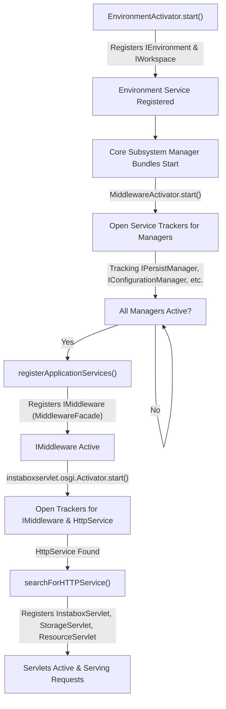
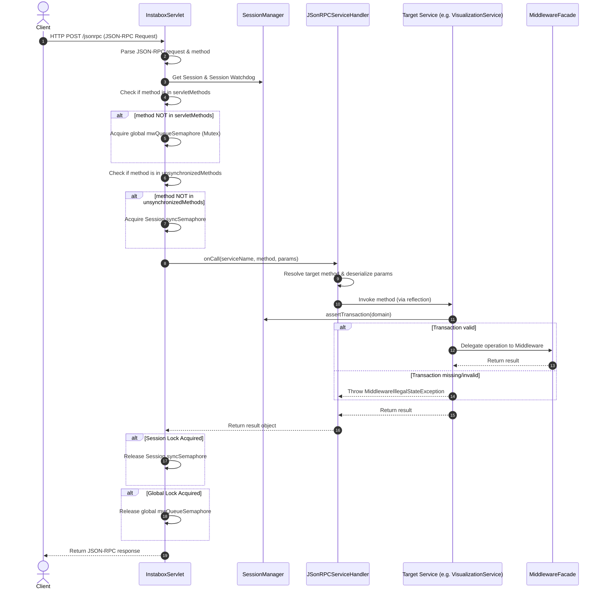
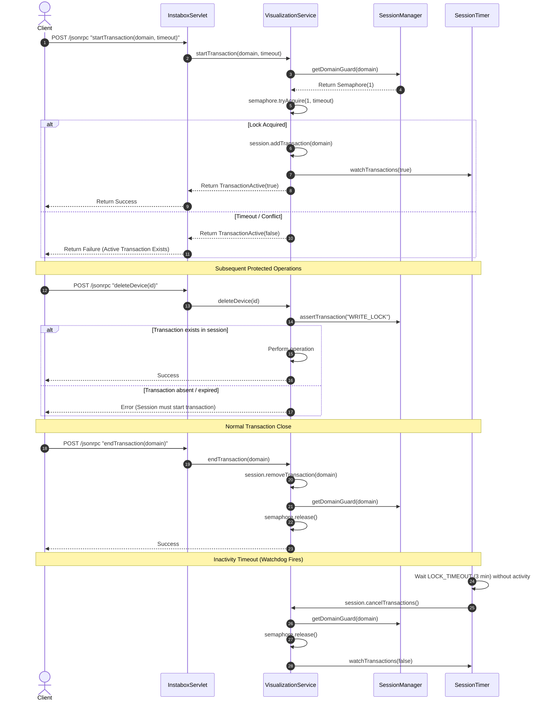

# eNet Project: Process Flows, OSGi Lifecycle, and Optimization Audit

This document provides a comprehensive technical mapping of the logical process flows, calling sequences, transaction/LUW (Logical Unit of Work) management, OSGi bundle lifecycles, and data persistence framework within the eNet project under `/home/hostrup/enet_project/src2/com/insta/instanet/` and `/home/hostrup/enet_project/src2/de/infoteam/insta/`. It concludes with an optimization audit highlighting dead code, concurrency bottlenecks, and performance-tuning recommendations.

---

## 1. OSGi Lifecycle and Bundle Initialization

The eNet gateway operates as an OSGi-based modular system. The lifecycle and startup flow of the bundles are tightly coupled using OSGi `ServiceTracker`s. The start-up sequence guarantees that higher-level web services are only published when all core hardware-abstraction and database managers are fully active.

### 1.1 Startup Order & Call Sequence
1. **Environment Bundle (`common/osgi/EnvironmentActivator`)**:
   - Loads global configurations (`conf/config.properties`) and system properties.
   - Registers the `IEnvironment` and `IWorkspace` services.
2. **Middleware Managers & Persistence Bundles**:
   - Individual manager bundles start up and register their respective interfaces with the OSGi registry (e.g., `IPersistManager`, `IConfigurationManager`, `IDeviceCatalogueManager`, `IDeviceManager`).
   - `PersistenceManagementActivator` registers event handlers for `ProjectLoad` and `ConfigurationActivated` and initializes database connections.
3. **Middleware Facade Bundle (`instanetbox/middleware/MiddlewareActivator`)**:
   - Opens `ServiceTracker`s for all individual subsystem managers.
   - Once **all** managers are tracked and available, it executes `registerApplicationServices()`, which initializes `MiddlewareFacade` and registers it under the `IMiddleware` service interface.
4. **Servlet Gateway Bundle (`instaboxservlet/osgi/Activator`)**:
   - Opens trackers for the `IMiddleware` service and the OSGi HTTP Service (`HttpService`).
   - Registers session-level handlers, Gogo shell commands, and event listeners.
   - Once the `HttpService` tracker resolves, it executes `searchForHTTPService()`, registering three key servlets to the HTTP container:
     - `/jsonrpc/*` &rarr; `InstaboxServlet` (JSON-RPC API handler)
     - `/storage/*` &rarr; `StorageServlet` (File transfer handler)
     - `/` &rarr; `ResourceServlet` (Static web content server)

### 1.2 Bundle Lifecycle and Dependencies Flow

---

## 2. Request Flow and JSON-RPC Invocation Pipeline

All client-facing operations (Visualisation or Commissioning) communicate via the JSON-RPC servlet (`InstaboxServlet`).

### 2.1 Sequence of Execution
1. **Request Intake**:
   - The servlet intercepts HTTP POST requests at `/jsonrpc/*` in the `doPost()` method.
   - Supports both single JSON-RPC objects and batch requests (delimited by `[` and `]`).
2. **Access Control & Security Check**:
   - The servlet resolves the target session and updates the watchdog timer to keep the session alive.
   - Checks if the user role is `UR_IBN` (Commissioning) or `UR_VISU` (Visualization) and configures the caller context in the middleware.
   - Invokes `UserManager.getInstance().handleSecurity()` to validate authentication tokens and SSL requirements.
3. **Locking & Synchronization**:
   - **Session-level Synchronization**: If the method is NOT in `unsynchronizedMethods` (which contains methods like `ping`, `getDevices`, `getLocations`), it acquires `session.getSyncSemaphore()` to serialize requests belonging to the same session.
   - **Global Middleware Synchronization**: If the method is NOT in `servletMethods` (which bypasses low-level locking), the thread acquires the global `this.mwQueueSemaphore` (a fair Semaphore of size 1). This enforces a global execution lock, ensuring only one thread accesses the core eNet middleware at a time.
4. **Service Dispatching**:
   - Delegates execution to `JSonRPCServiceHandler.onCall()`.
   - The service handler maps method names to active OSGi service instances using cached reflection signature maps (`mappingServiceToHashedInfoMethods`).
   - Deserializes parameters dynamically from the JSON payload.
5. **Execution**:
   - The resolved service (e.g., `VisualizationService`, `CommissioningService`) executes.
   - Asserts that any required transaction locks are held.
   - Returns the result, releases locks, and serializes the response.

### 2.2 Execution Sequence Diagram

---

## 3. Transaction & LUW (Logical Unit of Work) Management

Transactions in the eNet gateway are logical, domain-level locks (e.g., `WRITE_LOCK`, `DEVICE_CREATION`) that manage concurrency and prevent concurrent modifications of the eNet hardware database state.

### 3.1 Lock Acquisition and Session Management
- **Domain Guards**: `SessionManager` maintains a registry of semaphores called `domainGuards` (a `Map<String, Semaphore>`). Each transaction identifier corresponds to a binary semaphore (size 1).
- **Starting a Transaction**:
  - The client calls `startTransaction(domain, timeout)`.
  - The service attempts to acquire the domain's semaphore using `tryAcquire(1, timeout, TimeUnit.MILLISECONDS)`.
  - If acquired, the transaction is registered to the active session via `session.addTransaction(domain)`.
  - An event (`TransactionStartedEvent`) is posted to the session event queue.
- **Asserting Transactions**:
  - Protected operations (e.g., modifying devices, groups, configurations) call `SessionManager.get().assertTransaction(domain)`.
  - If the active session does not hold the named transaction lock, a `MiddlewareIllegalStateException` is thrown, blocking execution.
- **Ending a Transaction**:
  - The client calls `endTransaction(domain)`.
  - The transaction is removed from the session, the domain guard semaphore is released, and a `TransactionEndedEvent` is posted.

### 3.2 Inactivity Watchdog & Auto-Cancellation
- Each `Session` is bound to a dedicated background watchdog thread (`SessionTimer`).
- The watchdog runs a monitoring loop with configured timeouts:
  - `LOCK_TIMEOUT` (default: 3 minutes, customizable via `UserManagerData`).
  - `COMMISSIONING_TIMEOUT` (default: 30 minutes).
- If the session holds active transactions, the watchdog waits for `LOCK_TIMEOUT` milliseconds.
- If no request is received within this window, the watchdog wakes up and executes `session.cancelTransactions()`:
  1. Releases all held domain guard semaphores via `semaphore.release()`.
  2. Posts a `TransactionEndedEvent` to notify clients.
  3. Moves the transaction names to the session's `abortedTransactions` list.
  4. Automatically switches the physical device out of programming/commissioning mode back to normal mode.

### 3.3 Transaction Lifecycle Diagram

---

## 4. Data Persistence Framework

Data persistence in eNet relies on a custom object-oriented framework (built on Sonove Persistence libraries) that maps runtime in-memory objects to a persistent backend.

- **Object Management**: Runtime instances representing physical configurations (devices, channels, locations, timers) inherit from `PersistableBase` and reside in memory-managed containers (e.g., `PersistableDevicesContainer`).
- **Committing Changes**:
  - The middleware maintains dirty flags on modified objects.
  - When changes are committed (usually triggered by a transaction close or critical configuration steps), the `PersistenceManager` spawns a background thread (`saveThread`) which executes `savePersistDb()`.
  - This calls `PersistenceManagementActivator.dataManager.persistAllMarkedObjects()`, writing all modified entities to the persistent storage format.
- **Rollback Behaviour**:
  - There is no transactional SQL-style rollback.
  - If a transaction is aborted (e.g., due to a watchdog timeout), the domain locks are released to allow other sessions to write, but modified in-memory properties are not automatically reverted to their database-stored state unless a manual project reload (`ProjectLoad` event) is issued.

---

## 5. Optimization & Performance Audit

An analysis of the concurrency mechanisms, servlet registrations, and service classes has revealed several design patterns that restrict throughput or contain dead code.

### 5.1 Concurrency Bottlenecks & Lock Contention
- **Global Serialization on `mwQueueSemaphore`**:
  - The `doPost()` implementation in `InstaboxServlet` serializes **all** JSON-RPC requests targeting methods outside `servletMethods` using the global `mwQueueSemaphore`.
  - Consequently, if one user starts a long-running, slow middleware operation, all other users' requests (even read-only getters) block indefinitely.
  - *Recommendation*: Replace the global binary semaphore with a `ReentrantReadWriteLock`. This would allow concurrent read-only queries (like fetching device lists) while serializing modifications.
- **Unsynchronized Methods Discrepancy**:
  - Read-only operations like `getDevices` and `getLocations` are registered in the `unsynchronizedMethods` set, which correctly bypasses the *session-level* synchronization lock.
  - However, they are **not** registered in `servletMethods`. As a result, they still acquire the *global* `mwQueueSemaphore` lock. Bypassing session locks is useless because they are still blocked by the global serialization lock.
  - *Recommendation*: Add all read-only methods (like `getDevices`, `getDevicesWithParameterFilter`, and `getLocations`) to `servletMethods` so they do not participate in the global blocking queue.

### 5.2 Dead Code Analysis
- **`GdsServlet` Integration**:
  - The `GdsServlet` field in `Activator.java` (lines 183, 258) is declared, and the `GdsServlet.java` router mapping classes exist.
  - However, in `Activator.java`, the boolean switch `GDS_SERVLET_ACTIVATE` is hardcoded to `false`, and there is no call to register `/gds/*` with the HTTP service.
  - The entire `GdsServlet` routing mechanism, including its action classes, constitutes dead code.
- **Leftover Test Registrations**:
  - `servletMethods` registers `testMethod` (line 1172), which is not mapped to any productive service method.

### 5.3 Thread-Safety and Caching
- **Unsynchronized Cache in `JSonRPCServiceHandler`**:
  - `JSonRPCServiceHandler` contains a query cache `devicesWPFcache` (a plain `HashMap<String, String>`) for `getDevicesWithParameterFilter`.
  - Since multiple requests can execute this query concurrently, and the map is not a `ConcurrentHashMap` nor is access synchronized, this exposes the gateway to race conditions, memory visibility bugs, and corrupt cache states under load.
  - *Recommendation*: Wrap the cache using `ConcurrentHashMap` or a thread-safe caching library.
